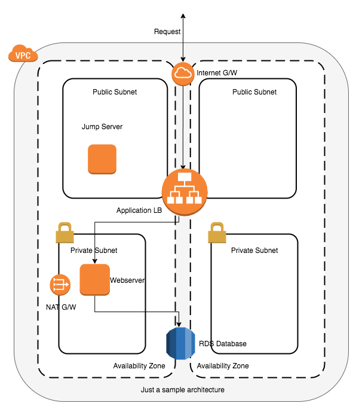

# This is Cloudformation

## Description
This is just a cloudformation boilerplate repository. You can use these templates to create AWS resources. Although all the templates can be run individually, the main.yaml file can be used to create the architecture mentioned below.

There is a boilerplate YAML file in the root directory which you can use to create resources of your own. If you are new to Cloudformation and want to know about the various sections of the templates, do checkout vpc.yaml in the VPC directory. You'll find explanations about sections and additional information such as mandatory and non-mandatory sections

## Components 
This template creates the following resources.

* 1 AWS Virtual Private Cloud
* 2 Subnets (Public and Private in the same AZ)
* Internet Gateway
* Network Address Translation Gateway
* Bastion Host (In Public Subnet)
* 1 Application Load Balancer and an associated Target Group
* 1 Elastic Compute Cloud Instance
* 1 Relational Database Service Instance
* Necessary Security Groups for the Bastion Host, EC2 Instance and the RDSinstance

## Architecture
This is the architecture of the infrastructure components which this template will create. It is a minimal architecture with a single AZ but all the major components are placed inside a private subnet.

